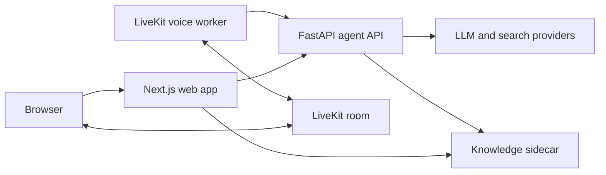

<div align="center">

# Intervyn

Practice job interviews out loud, with feedback tailored to your experience.

<p align="center">
  English |
  <a href="./README_zh.md">简体中文</a>
</p>

<p align="center">
  
  
  
  
  <a href="https://www.apache.org/licenses/LICENSE-2.0">
    
  </a>
</p>

</div>

## Overview

Intervyn is a self-hostable mock-interview app for candidates. It uses a CV and job description to prepare a practice session, supports a LiveKit voice interview when the voice services are configured, and produces a report with competency scores and next steps.

## Key Features

- Build a tailored question plan from a CV, job description, and available company context.
- Practice with a LiveKit voice interviewer when configured; typed answers are available as a fallback.
- Review competency scores, strengths, improvement areas, and example answers.
- Continue with a study plan and coaching chat using the available knowledge sources.
- Use the interface in English or Vietnamese.

## Tech Stack

| Area | Technologies |
| --- | --- |
| Web | Next.js App Router, React, TypeScript, Tailwind CSS |
| Agent API | Python, FastAPI, Pydantic, LangGraph |
| Shared contracts and tooling | Zod, generated JSON Schema, pnpm, Turborepo |
| Optional integrations | LiveKit voice worker, Supabase, Cloudflare R2, LightRAG |

## Architecture



The web app keeps private service credentials server-side. The LiveKit worker is a separate process; the knowledge sidecar is a separate FastAPI service.

## Quick Start

Prerequisites: Node 22, pnpm 11.5.2, Python 3.11+, `uv`, and Docker with Compose.

From the repository root:

```bash
bash scripts/setup.sh
pnpm build
pnpm intervyn init
docker compose up --build
```

In the setup wizard, choose **Offline demo** to select mock LLM and search providers without provider keys. The base Compose stack starts the web app, agent API, and knowledge sidecar; it does not start the voice worker. Configure LiveKit and voice providers, then run `docker compose --profile live up --build` to include it.

## Project Structure

```text
.
├── frontend/                 # Next.js app, shared contracts, and CLI
├── backend/                  # FastAPI agent, voice worker, and knowledge sidecar
├── infra/supabase/migrations/ # Optional Supabase schema
├── docs/                     # Project assets and instructions
├── scripts/                  # Repository setup scripts
└── docker-compose.yml        # Local service stack
```

## Development

| Command | Purpose |
| --- | --- |
| `pnpm build` | Build workspace packages and applications |
| `pnpm typecheck` | Type-check TypeScript workspace packages |
| `pnpm test` | Run workspace tests |
| `pnpm lint` | Check configured frontend files and run agent Ruff checks |
| `pnpm gen:schema` | Regenerate shared JSON Schemas |
| `uv --directory backend/services/lightrag run pytest` | Run the separate knowledge-sidecar tests |

`pnpm dev` starts the web package only; it does not start the Python API or LiveKit worker.

## Documentation

- [Frontend developer guide](frontend/README.md)
- [Backend developer guide](backend/README.md)
- [Repository agent guide](AGENTS.md)
- [Frontend agent guide](frontend/AGENTS.md) · [Backend agent guide](backend/AGENTS.md)
- [Knowledge sidecar](backend/services/lightrag/README.md) · [Skill packs](backend/skills/README.md)

## License

This project is licensed under the [Apache License 2.0](https://www.apache.org/licenses/LICENSE-2.0), as declared in the root package metadata.
