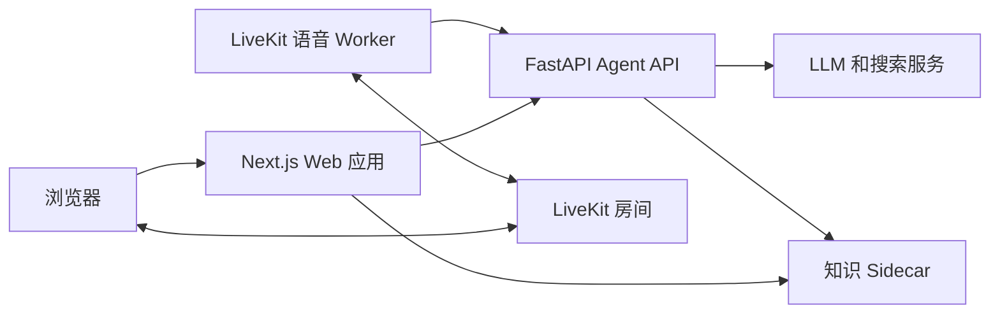

<div align="center">

# Intervyn

<p align="center">
  <a href="./README.md">English</a> |
  简体中文
</p>

<p align="center">
  
  
  
  
  <a href="./LICENSE">
    
  </a>
</p>

</div>

## 项目简介

Intervyn 是一款可自行部署的求职面试练习应用。它根据简历和职位描述准备练习面试；配置好语音服务后，可通过 LiveKit 进行语音面试；结束后生成包含能力评分和后续练习建议的报告。

## 主要功能

- 根据简历、职位描述和可用的公司背景信息生成定制问题计划。
- 配置好 LiveKit 后即可与语音面试官练习；语音不可用时也可输入回答。
- 查看各项能力评分、优势、待改进之处和示例回答。
- 通过学习计划和辅导对话，结合可用的知识来源继续练习。
- 界面支持英语和越南语。

## 技术栈

| 领域 | 技术 |
| --- | --- |
| Web | Next.js App Router、React、TypeScript、Tailwind CSS |
| Agent API | Python、FastAPI、Pydantic、LangGraph |
| 共享契约与工具 | Zod、生成的 JSON Schema、pnpm、Turborepo |
| 可选集成 | LiveKit 语音 Worker、Supabase、Cloudflare R2、LightRAG |

## 架构



Web 应用将私有服务凭据保留在服务端。LiveKit Worker 是独立进程；知识 Sidecar 是独立的 FastAPI 服务。

## 快速开始

前置条件：Node 22、pnpm 11.5.2、Python 3.11+、`uv`，以及 Docker Compose。

在仓库根目录运行：

```bash
bash scripts/setup.sh
pnpm --dir frontend build
pnpm --dir frontend intervyn init
docker compose up --build
```

在初始化向导中选择 **Offline demo**，即可选择无需 Provider 密钥的模拟 LLM 和搜索服务。唯一的 `docker-compose.yml` 会启动支持源码挂载与热更新的 Web 应用、Agent API 和知识 Sidecar，但不会启动语音 Worker。配置 LiveKit 和语音 Provider 后，运行 `docker compose --profile live up --build` 以启动 Worker。`make dev` 使用同一份配置，会在根目录 `.env` 中检测到完整的 LiveKit URL、API Key 和 API Secret 后自动启用语音 Worker，并等待 Worker 注册成功；未配置时则按离线基础模式启动。直接构建前端 Dockerfile 时仍默认生成生产版 standalone 镜像，此时需通过 `--build-arg` 传入 `NEXT_PUBLIC_*` 配置。

## 项目结构

```text
.
├── frontend/                  # Next.js 应用、共享契约和 CLI
├── backend/                   # FastAPI Agent、语音 Worker 和知识 Sidecar
├── infra/supabase/migrations/ # 可选的 Supabase 数据库迁移
├── docs/                      # 项目素材和说明
├── scripts/                   # 仓库设置脚本
└── docker-compose.yml         # 本地服务栈
```

## 开发

| 命令 | 用途 |
| --- | --- |
| `make dev` | 启动热更新开发环境；LiveKit 配置齐全时自动启动语音 Worker |
| `pnpm --dir frontend build` | 构建工作区包和应用 |
| `pnpm --dir frontend typecheck` | 对 TypeScript 工作区包进行类型检查 |
| `pnpm --dir frontend test` | 运行工作区测试 |
| `pnpm --dir frontend lint` | 检查指定的前端文件并运行 Agent Ruff 检查 |
| `pnpm --dir frontend gen:schema` | 重新生成共享 JSON Schema |
| `uv --directory backend/services/lightrag run pytest` | 运行独立的知识 Sidecar 测试 |

`pnpm --dir frontend dev` 只启动 Web 包，不会启动 Python API 或 LiveKit Worker。

## 文档

- [前端开发指南](frontend/README.md)
- [后端开发指南](backend/README.md)
- [仓库 Agent 指南](AGENTS.md)
- [前端 Agent 指南](frontend/AGENTS.md) · [后端 Agent 指南](backend/AGENTS.md)
- [知识 Sidecar](backend/services/lightrag/README.md) · [技能包](backend/skills/README.md)

## 许可证

本项目采用 [MIT License](./LICENSE)。
